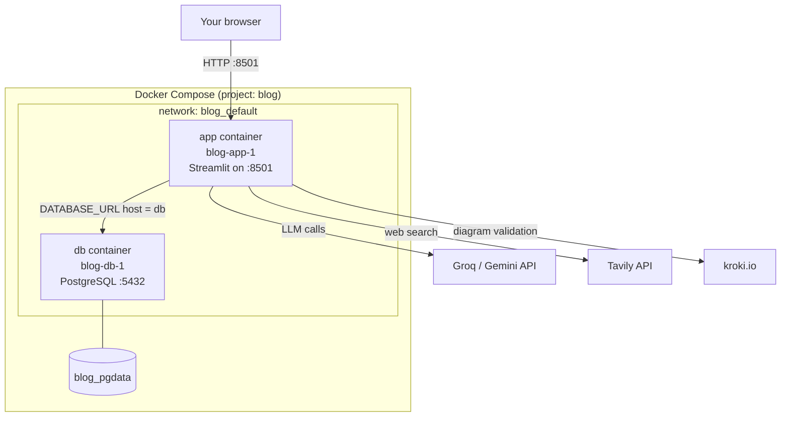
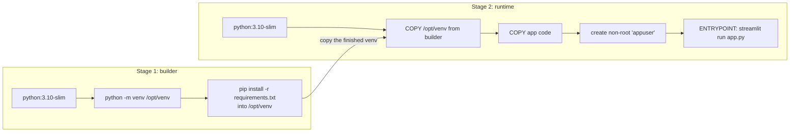
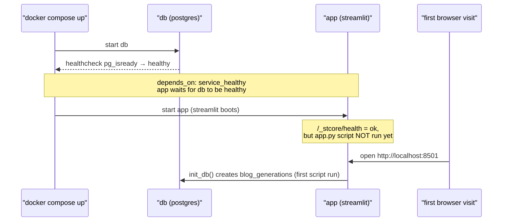
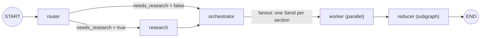
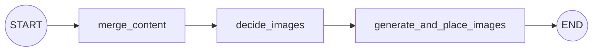

# Architecture — Docker, Postgres, and the complete app flow

This document explains **what is running**, **why**, and **how a single blog
request travels through the whole system** — from the button click in your
browser, through the container, the LangGraph pipeline, and into Postgres, then
back onto the screen.

It is written to be read top-to-bottom. Part 1 is the stack. Part 2 is Docker +
Postgres. Part 3 walks each pipeline stage on its own. Part 4 stitches everything
into one end-to-end flow. Part 5 is an operations cheat-sheet.

---

## Part 1 — What we're using (the stack)

| Layer | Technology | Where / version | Why this one |
|------|-----------|-----------------|--------------|
| **Container runtime** | Docker Desktop (WSL2 backend) | v4.86 | Runs the app + DB as isolated containers on your machine |
| **Orchestration (containers)** | Docker Compose | `docker-compose.yml` | Brings up the *two* services together with one command |
| **Base image** | `python:3.10-slim` | Dockerfile | Small Python 3.10 image (matches the local venv) |
| **Web app** | Streamlit | `1.61.1` (served by Uvicorn on `:8501`) | Fast Python UI; no separate frontend needed |
| **Pipeline engine** | LangGraph | `1.2.5` | Models the multi-agent flow as a state graph with fan-out |
| **LLM (default)** | Groq `openai/gpt-oss-120b` | `langchain-groq` | Fast, free-tier, good quality |
| **LLM (alternates)** | Google Gemini (3.1-flash-lite, 2.5-flash, 2.5-flash-lite) | `langchain-google-genai` | Escape hatch when Groq rate-limits |
| **Web research** | Tavily | `langchain-tavily` | Fetches fresh evidence when a topic needs it |
| **Diagram validation** | kroki.io | HTTP call in the reducer | Confirms Mermaid actually renders before shipping it |
| **Database (container)** | PostgreSQL | `postgres:16-alpine` | "Production" store for generation history |
| **Database (local dev/tests)** | SQLite | `./bloggen.db` | Zero-setup; same code path via `DATABASE_URL` |
| **ORM** | SQLAlchemy | `2.0.36` (+ `psycopg2-binary` driver) | Python objects ↔ rows; one codebase for SQLite/Postgres |
| **Schemas** | Pydantic v2 | `2.13.4` | Structured LLM outputs (Plan, RouterDecision, …) |

> **Two databases, one code path.** Locally you get a SQLite *file*; in Docker you
> get a Postgres *server*. The only thing that changes is the `DATABASE_URL`
> environment variable — see Part 2.

---

## Part 2 — Docker & Postgres: what's actually happening

### 2.1 The big picture: two containers on one network

`docker compose up` starts **two containers** and wires them together:



- **`app`** — our image (`ai-blog-generator`), running Streamlit. This is the only
  container exposed to your machine (`localhost:8501`).
- **`db`** — the stock `postgres:16-alpine` image. It is **not** published to your
  host by default; only the `app` container can reach it, over the private compose
  network `blog_default`.
- **`blog_pgdata`** — a named Docker **volume**. This is where Postgres physically
  writes its data files, and it's what makes history survive restarts.

### 2.2 How the app finds Postgres (no IP addresses)

Inside the compose network, every service is reachable **by its service name**.
The app is told where the database is via one environment variable set in
`docker-compose.yml`:

```yaml
environment:
  DATABASE_URL: postgresql://bloggen:bloggen@db:5432/bloggen
#                            └user┘ └pass┘ └hostname = the "db" service
```

`db` resolves via Docker's built-in DNS to the `db` container. `db/connection.py`
reads `DATABASE_URL`; if it's unset (local dev), it falls back to
`sqlite:///./bloggen.db`. **That single variable is the whole dev-vs-prod switch.**

> We inject `DATABASE_URL` through compose's `environment:` (not `.env`) so it
> always points at the `db` service and can't be accidentally overridden. `.env`
> only carries the API keys (`GROQ_API_KEY`, `GOOGLE_API_KEY`, `TAVILY_API_KEY`),
> loaded via `env_file`.

### 2.3 How the image is built (multi-stage)

The `Dockerfile` uses **two stages** so the final image is lean and reproducible:



Why it's shaped this way:

- **Self-contained venv.** Stage 1 installs everything into `/opt/venv`; stage 2
  just copies that folder. All dependencies ship as pre-built **manylinux wheels**
  (including `psycopg2-binary`, `pydantic-core`, `pyarrow`), so **no compiler is
  needed** in the image.
- **Non-root.** The app runs as `appuser`, not root — safe because the container
  writes nothing to disk (Postgres holds all state; downloads happen in-browser).
- **Healthcheck without `curl`.** `python:3.10-slim` has no `curl`, so the
  `HEALTHCHECK` probes `http://localhost:8501/_stcore/health` with a one-line
  `urllib` script.

### 2.4 What `.dockerignore` keeps out

`COPY . .` would otherwise copy huge/secret things into the image. `.dockerignore`
excludes them: `.venv/` (6,700+ files), `.git`, `__pycache__`, `*.db`,
`outputs/`, `Notebooks/`, planning docs — and **critically `.env`**, so your API
keys never get baked into the image.

### 2.5 Startup order & the "lazy `init_db`" detail



Two things worth knowing:

1. **`app` waits for `db`.** `depends_on: db: condition: service_healthy` plus the
   `pg_isready` healthcheck means the app never starts before Postgres is ready —
   no connection-race on boot.
2. **`init_db()` runs lazily.** `app.py` calls `init_db()` at module top level, but
   Streamlit only runs `app.py` when a **browser session connects** — the
   `/_stcore/health` probe does *not* run it. So the `blog_generations` table is
   created on the **first page load**, not at container start. It's safe because
   within that first run `init_db()` (line 28) executes *before* the history query
   (line 67), so the table always exists before it's read.

### 2.6 Where the data lives & how persistence works

Postgres writes to `/var/lib/postgresql/data`, which is mounted from the named
volume `blog_pgdata`. The volume has its own lifecycle, separate from the
containers:

| Command | Containers | `blog_pgdata` volume | History |
|--------|-----------|----------------------|---------|
| `docker compose up -d` | created & started | created if missing | preserved |
| `docker compose restart` | restarted | untouched | preserved |
| `docker compose down` | **removed** | **kept** | **preserved** |
| `docker compose up -d` (again) | recreated | reused | still there |
| `docker compose down -v` | removed | **deleted** | **wiped** |

This is exactly what the Phase-4 verification proved: insert a row → `down` →
`up` → the row is still there.

---

## Part 3 — Subpart flows (each stage on its own)

The pipeline is a **LangGraph state graph** (`core/graph.py`). All nodes read from
and write to a shared `State` dict (`core/state.py`). Here is the whole graph:



The `run()` entry point (`core/runner.py`) streams this graph and fires an
`on_progress(node, label)` callback as each node completes, which is how the UI
shows phases flipping done. Parallel workers are capped by
`PIPELINE_MAX_CONCURRENCY` (default **2**) to respect LLM rate limits.

### 3.1 Router — "do we even need to search the web?"

`core/router.py`. Sends the topic to the LLM and gets back a structured
`RouterDecision`:

- **`closed_book`** → `needs_research = false` (evergreen concepts). Skip research.
- **`hybrid`** → `needs_research = true` (evergreen + fresh examples).
- **`open_book`** → `needs_research = true` (news/roundup/"latest").

If research is needed, it also produces **3–10 scoped search queries**.
`route_next(state)` then returns `"research"` or `"orchestrator"`.

**Writes:** `needs_research`, `mode`, `queries`.

### 3.2 Research — gather & de-duplicate evidence (only if needed)

`core/research.py`. For each query, calls Tavily (`_tavily_search`, up to 6
results each), collects the raw hits, then asks the LLM to synthesize them into a
clean, de-duplicated list of `EvidenceItem`s (title/url/snippet/date). Finally it
de-dupes by URL. If nothing comes back, evidence is simply empty (the run
continues).

**Writes:** `evidence`. **External call:** Tavily API.

### 3.3 Orchestrator — plan the outline, then fan out

`core/orchestrator.py`. Turns the topic (+ any evidence) into a structured `Plan`:
a `blog_title`, `audience`, `tone`, `blog_kind` (explainer / tutorial /
news_roundup / comparison / system_design), and **5–9 `Task`s**. Each `Task` has a
goal, 3–6 bullets, a target word count, and flags (`requires_code`,
`requires_citations`, …).

Then `fanout(state)` emits **one LangGraph `Send("worker", payload)` per task** —
this is the parallel fan-out. Each payload is a self-contained dict (task + topic +
mode + plan + evidence), so a worker doesn't need the full graph state.

**Writes:** `plan` → dispatches N workers.

### 3.4 Workers — write each section in parallel

`core/worker.py`. Each worker writes **one** Markdown section (starts with
`## <Title>`, covers all bullets, hits the word target, cites only provided
evidence URLs when required). Up to 2 run concurrently.

The result of each worker is a single-element list `[(task_id, section_md)]`. Because
the `sections` channel is declared `Annotated[List[...], operator.add]`, LangGraph
**concatenates** all workers' contributions automatically.

**Writes:** `sections` (appended). **External call:** LLM (per worker).

### 3.5 Reducer — merge, decide diagrams, validate, place

`core/reducer.py` is itself a **3-node subgraph**:



1. **`merge_content`** — sort sections by `task_id`, join them, prepend
   `# {blog_title}` → `merged_md`.
2. **`decide_images`** — ask the LLM (structured `GlobalDiagramPlan`) whether up to
   **3 Mermaid diagrams** would help, insert `[[DIAGRAM_n]]` placeholders into the
   text, and return the raw Mermaid for each. If this step fails (weaker models
   struggle to echo the whole doc as JSON), it **degrades gracefully** — ship the
   blog with no diagrams rather than fail the run.
3. **`generate_and_place_images`** — for each proposed diagram: clean it
   (`_clean_mermaid`: strip ``` fences, fix the `|>`→`|` bug, split `;` lines),
   then **validate it against kroki.io** (`_mermaid_ok`). Only a definitive HTTP
   400 drops a diagram; transient 5xx errors **fail open** (keep it). Valid
   diagrams replace their placeholder with a fenced ` ```mermaid ` block.

**Writes:** `merged_md`, `md_with_placeholders`, `diagram_specs`, and finally
`final` (the shipped Markdown). **External call:** kroki.io.

### 3.6 Persistence — wrap the run and save the row

`db/service.py` (`generate_and_save`) is the one place that connects `core` (which
never imports `db`) to the database:

1. `create_generation(status="running")` — a row exists **before** any AI work.
2. records `llm_provider` / `llm_model`.
3. calls `core.run(...)` (forwarding `on_progress`).
4. **on success:** `_extract_fields` pulls metrics (`word_count`, `diagram_count`,
   `section_count`, `blog_kind`, `blog_title`) + full `plan_json` / `evidence_json`,
   flips the row to `completed`.
   **on failure:** flips to `failed` with `error_message` and (by default) returns
   the row instead of raising.

### 3.7 UI rendering — Mermaid in Streamlit

`ui/components.py`. Streamlit's `st.markdown` does **not** render Mermaid, so
`render_blog` splits the final Markdown on ` ```mermaid ` fences and interleaves:

- **prose** → `st.markdown`
- **each diagram** → an inline **mermaid.js** renderer inside a `components.html`
  iframe (dark theme).

> Note: the in-app diagram renderer loads `mermaid.js` from a CDN in **your
> browser** (a client-side fetch), while kroki validation happened earlier
> **server-side** in the container. So diagrams are validated in the container but
> drawn in the browser.

---

## Part 4 — The complete combined flow (end to end)

Here is one blog request, from click to saved row and back onto the page:

```mermaid
sequenceDiagram
    participant U as "You (browser)"
    participant APP as "app.py (Streamlit)"
    participant SVC as "db/service.py"
    participant CORE as "core/ pipeline (LangGraph)"
    participant EXT as "Groq/Gemini · Tavily · kroki"
    participant PG as "Postgres (blog_pgdata)"

    U->>APP: type topic, pick model, click Generate
    APP->>SVC: generate_and_save(topic, provider, model, on_progress)
    SVC->>PG: INSERT row (status=running)
    SVC->>CORE: run(topic, provider, model)

    CORE->>EXT: router → (research?) → orchestrator (LLM; Tavily if needed)
    CORE-->>APP: on_progress("router"/"research"/"orchestrator", …)
    CORE->>EXT: workers write sections in parallel (LLM ×N)
    CORE-->>APP: on_progress("worker", …)
    CORE->>EXT: reducer merges + validates Mermaid (kroki)
    CORE-->>APP: on_progress("reducer", …)
    CORE-->>SVC: final state (markdown, plan, diagrams, evidence)

    SVC->>PG: UPDATE row (status=completed, metrics, JSON)
    SVC-->>APP: the finished BlogGeneration row
    APP->>U: render blog (prose + Mermaid iframes) + download button
    Note over APP,PG: next rerun → sidebar list_generations() shows it
```

In one sentence: **the browser hits the Streamlit container, which records a
"running" row in Postgres, runs the LangGraph pipeline (calling Groq/Gemini,
Tavily, and kroki along the way), streams phase updates back to the UI, saves the
finished blog + metrics to Postgres, and renders it — after which the history
sidebar picks it up.**

### External dependencies at runtime

- **From the `app` container (server-side):** Groq and/or Google APIs (LLM),
  Tavily API (research), kroki.io (Mermaid validation). Kroki **fails open**, so a
  kroki outage degrades diagram quality but never crashes a run.
- **From your browser (client-side):** `mermaid.js` from a CDN, to draw diagrams
  in the rendered blog.

The container is therefore **not fully self-contained** — it needs outbound HTTPS.

---

## Part 5 — Operations cheat-sheet

```bash
# One-time: create your env file and fill in the API keys
cp .env.example .env      # then edit GROQ_API_KEY / GOOGLE_API_KEY / TAVILY_API_KEY

# Build + start everything (app on http://localhost:8501)
docker compose up -d --build

# See status / health
docker compose ps

# Tail logs
docker compose logs -f app

# Stop (KEEP history) vs. stop and WIPE the database
docker compose down          # keeps blog_pgdata volume
docker compose down -v       # deletes the volume (history gone)

# Peek at the database
docker compose exec db psql -U bloggen -d bloggen -c "\dt"
docker compose exec db psql -U bloggen -d bloggen -c "SELECT topic, status FROM blog_generations;"
```

### Where each thing lives

| Concern | File(s) |
|--------|---------|
| Container image | `Dockerfile`, `.dockerignore` |
| Two-service stack | `docker-compose.yml` |
| Secrets template | `.env.example` (real keys in `.env`, gitignored) |
| Pipeline graph | `core/graph.py`, `core/runner.py`, `core/state.py` |
| Pipeline nodes | `core/router.py`, `research.py`, `orchestrator.py`, `worker.py`, `reducer.py`, `mermaid_utils.py` |
| Database | `db/models.py`, `connection.py`, `crud.py`, `service.py` (see `db/README.md`) |
| Web UI | `app.py`, `ui/components.py`, `ui/history.py`, `ui/theme.py` |
```
