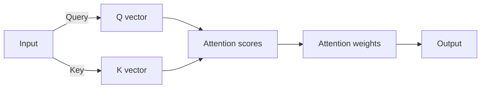

# Self Attention in Transformer Architecture

## Introduction to Self Attention
Self attention is a key component in transformer architecture, enabling the model to attend to different parts of the input sequence simultaneously. 
* Define self attention and its role in transformer models: Self attention is a mechanism that allows the model to weigh the importance of different input elements relative to each other.
* Explain the difference between self attention and traditional attention mechanisms: Unlike traditional attention, self attention does not rely on recurrent neural networks (RNNs) or convolutional neural networks (CNNs), instead using query, key, and value vectors to compute attention weights.
* Discuss the benefits of self attention in natural language processing tasks: Self attention benefits NLP tasks by allowing the model to capture long-range dependencies and contextual relationships between input elements, leading to improved performance in tasks such as language translation and text classification.


*Self Attention Mechanism*

## Mathematical Formulation of Self Attention
The self attention mechanism is a core component of the Transformer architecture, allowing the model to attend to different parts of the input sequence simultaneously. To understand how self attention works, we need to derive the self attention equation step by step. The equation is based on the concept of attention, which is calculated as the weighted sum of the value vectors, where the weights are computed based on the similarity between the query and key vectors.

* The self attention equation is derived as follows:
  * First, we compute the query, key, and value vectors from the input sequence.
  * Then, we compute the attention scores by taking the dot product of the query and key vectors and applying a scaling factor.
  * The attention scores are then passed through a softmax function to obtain the attention weights.
  * Finally, we compute the output of the self attention mechanism by taking the weighted sum of the value vectors, where the weights are the attention weights.

## Implementing Self Attention
To implement self attention from scratch, we need to understand its core components. 
### Code Implementation
A minimal code sketch for self attention can be written as follows:
```python
import torch
import torch.nn as nn
import torch.nn.functional as F

class SelfAttention(nn.Module):
    def __init__(self, embed_dim, num_heads):
        super(SelfAttention, self).__init__()
        self.embed_dim = embed_dim
        self.num_heads = num_heads
        self.query_linear = nn.Linear(embed_dim, embed_dim)
        self.key_linear = nn.Linear(embed_dim, embed_dim)
        self.value_linear = nn.Linear(embed_dim, embed_dim)

    def forward(self, x):
        # Get query, key, and value vectors
        Q = self.query_linear(x)
        K = self.key_linear(x)
        V = self.value_linear(x)

        # Compute attention scores
        attention_scores = torch.matmul(Q, K.T) / math.sqrt(self.embed_dim)

        # Compute attention weights
        attention_weights = F.softmax(attention_scores, dim=-1)

        # Compute output
        output = torch.matmul(attention_weights, V)
        return output
```
### Masking and Multi-Head Attention
Masking is crucial in self attention implementations to prevent the model from attending to future tokens, which can lead to information leakage. 
In multi-head attention mechanisms, self attention plays a key role by allowing the model to jointly attend to information from different representation subspaces at different positions. 
This is achieved by applying self attention multiple times in parallel, with different linear projections of the input sequence.

## Edge Cases and Failure Modes
Self attention in Transformer architecture can be sensitive to certain edge cases and failure modes. The performance of self attention can be impacted by the input size, with larger input sizes potentially leading to increased computational costs and decreased performance. 
* Input size is a critical factor, as self attention mechanisms consider the relationships between all input elements, resulting in quadratic complexity with respect to input size.
* Sparse input data can also affect self attention, as the mechanism may struggle to capture meaningful relationships between elements in sparse datasets.
The failure modes of self attention can occur in scenarios where the input data is highly ambiguous or noisy, leading to difficulties in accurately capturing dependencies between input elements.

## Performance and Cost Considerations
The self-attention mechanism in Transformer architecture has significant performance and cost implications. 
* Discussing the computational complexity of self attention, it is quadratic with respect to the input sequence length, making it computationally expensive for long sequences.
* The memory requirements of self attention mechanisms are also substantial, as they require storing the attention weights and the input sequence, which can be memory-intensive for large models and long sequences.
* Analyzing the trade-offs between self attention and other attention mechanisms, such as local attention or hierarchical attention, self attention provides better performance but at a higher computational cost, while other mechanisms may be more efficient but less effective. 
Overall, understanding these considerations is crucial for optimizing the performance and cost of Transformer-based models.

## Security and Privacy Considerations
Self attention mechanisms in transformer architectures can introduce potential security risks. These risks include the exposure of sensitive information through attention weights, which can reveal important features of the input data. Additionally, self attention can be vulnerable to adversarial attacks, where malicious input is designed to manipulate the model's attention and produce incorrect results.

The importance of data privacy in self attention applications cannot be overstated. As self attention models are often trained on large amounts of personal data, ensuring the privacy and security of this data is crucial. This includes protecting against unauthorized access and ensuring that sensitive information is not leaked through the model's outputs.

Potential attacks on self attention models include data poisoning attacks, where an attacker manipulates the training data to compromise the model's performance, and inference attacks, where an attacker attempts to infer sensitive information about the input data from the model's outputs. Understanding these potential attacks is essential to developing secure and private self attention applications.

## Debugging and Observability Tips
To effectively debug and observe self attention models, several strategies can be employed. 
* Visualizing self attention weights is crucial as it provides insight into how the model is focusing on different parts of the input data. This can be done using heatmap visualizations, where each cell represents the attention weight between two input elements.
* Monitoring self attention performance metrics is also vital. This includes tracking metrics such as attention entropy, which measures the uncertainty of the attention distribution, and attention distance, which measures how far the attention is spread out. 
* Common pitfalls in self attention model development include overfitting due to large model sizes and underfitting due to insufficient training data. Another pitfall is the vanishing gradient problem, which can occur when the model is too deep, causing gradients to become very small during backpropagation. 
By being aware of these potential issues and using visualization and monitoring techniques, developers can improve the performance and reliability of their self attention models.
