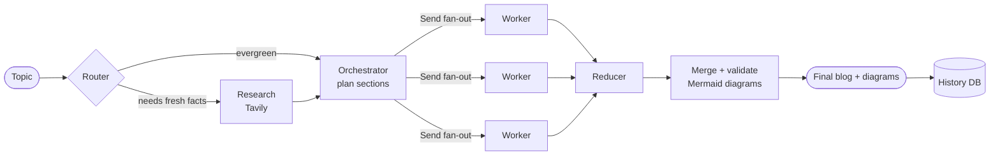

# AI Blog Generator

> A multi-agent system that researches, plans, and writes technical blog posts —
> complete with validated diagrams — from a single topic.


Give it a topic. It decides whether the topic needs fresh web research, plans the
post into sections, writes those sections **in parallel** with independent LLM
workers, then merges them and generates **Mermaid diagrams** — each validated
against a real renderer before it ships. Every run is persisted, and the whole thing
comes up with one Docker command.

---

## Features

- **🧠 Multi-agent pipeline** — router → research → orchestrator → parallel workers →
  reducer, built as a [LangGraph](https://langchain-ai.github.io/langgraph/) state graph.
- **🔀 Conditional research** — the router decides per-topic whether to hit the web
  ([Tavily](https://tavily.com)); evergreen topics skip it, recent ones get grounded.
- **⚡ Parallel section writing** — independent sections are written concurrently via
  LangGraph `Send`, then merged back in order.
- **📊 Validated Mermaid diagrams** — proposed diagrams are cleaned, validated via the
  [kroki](https://kroki.io) renderer, and only shipped if they actually render.
- **🔁 Multi-provider LLMs** — switch between **Groq** (default, fast) and **Google
  Gemini** from the UI, with automatic repair of malformed structured output.
- **💾 Persistent history** — every generation is saved (provider, timing, word/section
  counts, success/failure) and browsable in a sidebar. SQLite locally, Postgres in Docker.
- **🐳 One-command deploy** — `docker compose up` brings up the app + Postgres, wired
  together with persistent storage.

---

## Architecture



1. **Router** — classifies the topic (`closed_book` / `hybrid` / `open_book`) and
   decides whether research is needed.
2. **Research** *(conditional)* — runs Tavily searches and distills a de-duplicated
   evidence pack.
3. **Orchestrator** — produces a structured `Plan`: blog kind, title, audience, and a
   list of section tasks.
4. **Workers** — write each section in parallel; results merge into a shared state
   channel and are re-sorted into document order.
5. **Reducer** — merges sections, proposes up to 3 Mermaid diagrams, validates each,
   and places the survivors.

> 📖 For the full mechanics — how parallel results merge, the Docker/Postgres topology,
> and an end-to-end sequence diagram — see **[ARCHITECTURE.md](ARCHITECTURE.md)**.

---

## Quickstart (Docker — recommended)

**Prerequisites:** Docker Desktop, and API keys for [Groq](https://console.groq.com)
and [Tavily](https://tavily.com) (and optionally [Google AI Studio](https://aistudio.google.com/apikey)).

```bash
# 1. Configure secrets
cp .env.example .env        # then edit .env and add your API keys

# 2. Build and start the app + Postgres
docker compose up --build

# 3. Open the app
#    http://localhost:8501
```

That's it — the app and a Postgres database start together, and your history persists
across restarts in a Docker volume. Stop with `docker compose down` (add `-v` to also
wipe stored history).

## Run locally (without Docker)

Uses a local SQLite file instead of Postgres — no database server needed.

```bash
python -m venv .venv
source .venv/bin/activate          # Windows: .venv\Scripts\activate
pip install -r requirements.txt

cp .env.example .env               # add your API keys
streamlit run app.py               # opens http://localhost:8501
```

---

## Configuration

All configuration is via environment variables in `.env` (see `.env.example`):

| Variable | Required | Purpose |
| --- | --- | --- |
| `GROQ_API_KEY` | ✅ | Default LLM provider (text generation). |
| `TAVILY_API_KEY` | ✅ | Web research. |
| `GOOGLE_API_KEY` | optional | Enables the Google Gemini models in the picker. |
| `DATABASE_URL` | optional | Postgres URL. Unset → local SQLite. Docker sets this automatically. |
| `LLM_TEMPERATURE` | optional | Sampling temperature (default `0`). |
| `LLM_MAX_RETRIES` | optional | Provider retry count on rate limits (default `6`). |
| `PIPELINE_MAX_CONCURRENCY` | optional | Max parallel section workers (default `2`). |

**Models available in the UI:** Groq `llama-3.3-70b` (default), Google
`gemini-3.1-flash-lite`, `gemini-2.5-flash`, `gemini-2.5-flash-lite`.

---

## Usage

1. Open **http://localhost:8501**.
2. (Optional) Pick an LLM provider/model from the dropdown.
3. Enter a topic — e.g. *"Self Attention in Transformer Architecture"* — and click
   **🚀 Generate**.
4. Watch the live phase progress; the finished blog renders inline with real diagrams.
5. Browse past generations in the **history sidebar**.

---

## Project structure

```
Blog/
├── app.py                 # Streamlit entrypoint (UI + pipeline, one process)
├── core/                  # The LLM pipeline (database-agnostic)
│   ├── graph.py           #   LangGraph wiring (router → … → reducer)
│   ├── router.py          #   research-or-not decision
│   ├── research.py        #   Tavily search + evidence pack
│   ├── orchestrator.py    #   builds the section plan, fans out workers
│   ├── worker.py          #   writes one section
│   ├── reducer.py         #   merges sections, generates diagrams
│   ├── llm.py             #   multi-provider setup + structured-output repair
│   ├── mermaid_utils.py   #   Mermaid clean + validate (kroki)
│   └── schemas.py         #   Pydantic models (Plan, Task, RouterDecision, …)
├── db/                    # Persistence layer (depends on core, never the reverse)
│   ├── models.py          #   SQLAlchemy model (portable SQLite ⇆ Postgres)
│   ├── crud.py            #   create / read / update / delete
│   └── service.py         #   runs the pipeline and persists the result
├── ui/                    # Streamlit widgets (topic input, progress, blog renderer)
├── tests/                 # Hermetic pytest suite (no network, no API keys)
├── Dockerfile             # Multi-stage, non-root
├── docker-compose.yml     # app + Postgres
└── ARCHITECTURE.md        # Deep-dive: Docker/Postgres + full app flow
```

---

## Tech stack

| Layer | Choice |
| --- | --- |
| Orchestration | LangGraph |
| LLMs | Groq (Llama 3.3 70B), Google Gemini — via LangChain |
| Research | Tavily |
| Diagrams | Mermaid, validated via kroki |
| Schemas | Pydantic v2 |
| Web UI | Streamlit |
| Database | SQLAlchemy → SQLite (dev) / PostgreSQL (prod) |
| Packaging | Docker + Docker Compose |

---

## Testing

The suite is **hermetic** — it needs no network, no API keys, and no running Postgres.
It uses a throwaway SQLite database and stubs the LLM, so it runs in seconds anywhere.

```bash
pip install pytest
pytest
```

Covers the database layer (CRUD + the persistence wrapper) and the LLM
structured-output repair logic.

---

## How it works, in depth

The pipeline is a LangGraph **orchestrator–worker workflow** with one agentic decision
(the router). Sections are fanned out with `Send` and merged through a reducer channel
(`Annotated[list, operator.add]`), then re-sorted into order. Diagram generation
**fails open** — a flaky validator never strips a good diagram; only a definitive
syntax error does.

See **[ARCHITECTURE.md](ARCHITECTURE.md)** for the container topology, the dev/prod
database switch, and a full end-to-end sequence diagram.
